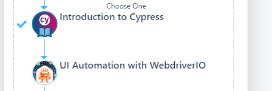

# Cypress general documentation <!-- omit in toc -->

- [Getting started](#getting-started)
  - [Cypress web-site](#cypress-web-site)
    - [Documentation](#documentation)
  - [Training/courses](#trainingcourses)
    - [Cypress.io](#cypressio)
    - [Test Automation University](#test-automation-university)
      - [General and introduction](#general-and-introduction)
      - [Advanced/others](#advancedothers)
      - [API testing](#api-testing)
- [Ambassadours/experts](#ambassadoursexperts)
  - [Filip Hric](#filip-hric)
  - [Gleb Bahmutov](#gleb-bahmutov)
- [Selected useful tips, tricks and modules](#selected-useful-tips-tricks-and-modules)

## Getting started

### Cypress web-site

- [cypress.io](https://www.cypress.io/)

#### Documentation

- [Cypress documentation and guides](https://docs.cypress.io/guides/overview/why-cypress)

### Training/courses

#### Cypress.io

This course looks very promising starting from scratch and explaining "everything" on the way:

- [Real World Testing with Cypress](https://learn.cypress.io/?utm_medium=banner&utm_source=website&utm_term=&utm_content=real-world-testing)

#### Test Automation University

##### General and introduction

These courses give you a general foundation and overview of the building blocks cypress testing consist of:

- <https://testautomationu.applitools.com/setting-a-foundation-for-successful-test-automation/>
- <https://testautomationu.applitools.com/javascript-tutorial/>
- <https://testautomationu.applitools.com/automating-in-the-browser-using-javascript/>
- <https://testautomationu.applitools.com/mocha-javascript-tests/>
- <https://testautomationu.applitools.com/chai-test-assertions/>
- <https://testautomationu.applitools.com/cypress-tutorial/>

The courses mentioned above are the first 6 ones listed in the Web UI JavaScript Path:

##### Advanced/others

- <https://testautomationu.applitools.com/advanced-cypress-tutorial/>
- <https://testautomationu.applitools.com/cypress-with-typescript/>

##### API testing

- <https://applitools.com/event/test-your-api-with-cypress/>
- <https://www.youtube.com/watch?v=mPZJdAH1alc>

## Ambassadours/experts

### [Filip Hric](https://filiphric.com/)

- frequently new cypress tips on his blog
- courses
- workshops

### [Gleb Bahmutov](https://glebbahmutov.com/)

- [cypress.tips](https://cypress.tips/)

## Selected useful tips, tricks and modules

- [Create documentation videos](cypress_documentation_videos.md)
- [Information on how to set up Cypress testing for you product](setup-cypress.md)
